### Node simple practice session

**When to use node:**
```shell
1.	Data Streaming applications: Example Instagram, when you search anything, it will show you unlimited data.
2.	Real time chat applications: example WhatsApp
3.	I/O bound:  input/output is non-blocking. Means if one thread is taking time.

```
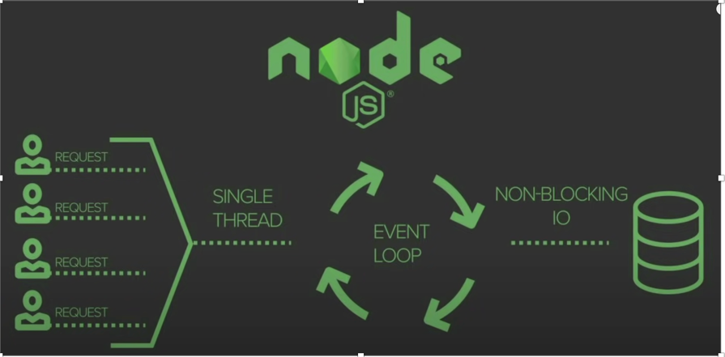

```shell
And another thread is ready to return result then it will return the result
of second thread first. Suppose you hit 2 calls one is to access DB, and another
is to hit API. DB call is taking 10 seconds to return the result and API is only
taking 3 seconds to return the call then it returns the API result and after
7 seconds you will also get DB result.
```

**REPL feature: Read, Eval, Print, Loop:**

```shell
It is same as command line in window.
How to open editor mode in node:
Enter node, once you enter into node then write “.editor” and enter you code.
Below is the example in which I am writing a function.

```
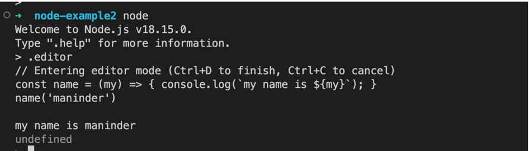

```shell
Once you write the code, then press ctrl +D

How to write, read content in node:

We can use FS to read, write in node.

```
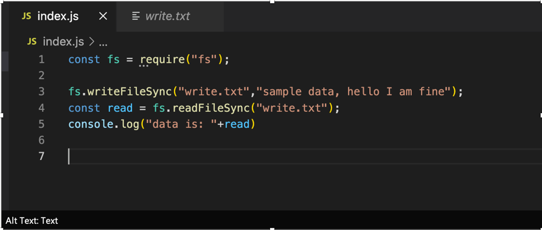

```shell
In case, it returns you binary code like this:

```
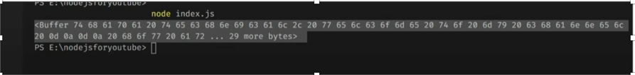

```shell
Convert it into string and then print it:

```
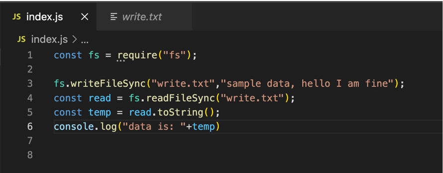

```shell
Read, append, delete file in node using fs:

```
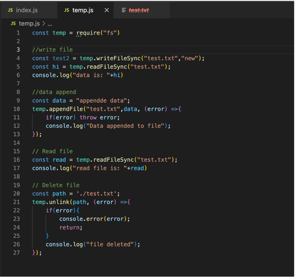

**Synchronous and Asynchronous:**
```shell
Synchronous and asynchronous are two ways of coordinating tasks or communication
between different systems or components.

Synchronous communication means that two or more components or systems work 
together in a coordinated way, where each component waits for the other to
complete a task before moving on to the next one. In other words, synchronous
communication is like a conversation between two people where each person takes
turns speaking and listening, and nothing else can happen until the current
speaker is finished.

On the other hand, asynchronous communication means that components or systems
can work independently and in parallel, without waiting for each other to complete
a task. Asynchronous communication is like sending an email or text message, where
the sender can send the message and move on to other tasks without waiting for
an immediate response.
In simpler terms, synchronous communication is like a queue where everyone has to wait for their turn, while asynchronous communication is like a group chat where people can send and receive messages at their own pace.

Synchronous example:

```
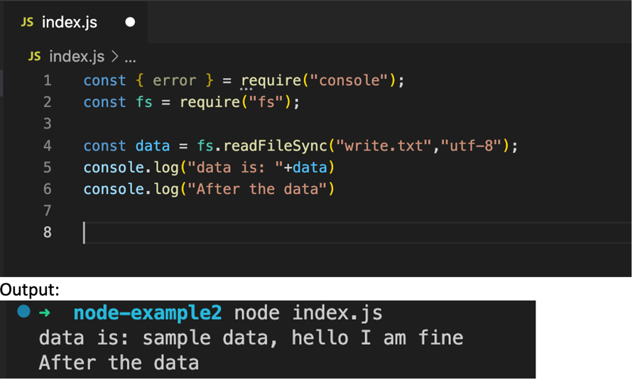

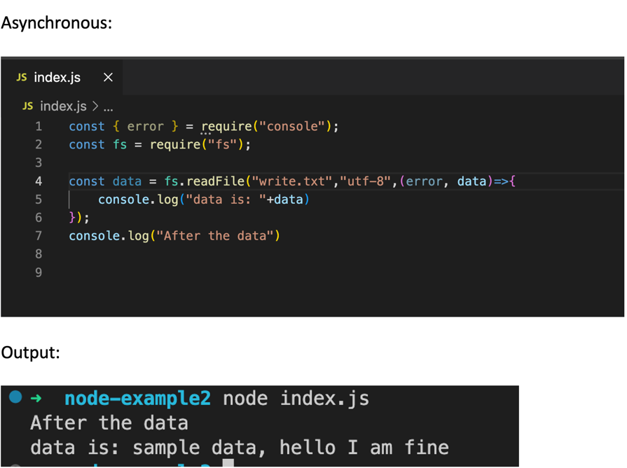

```shell
You can use “OS” module to check the operating system and free memory and many more:
```
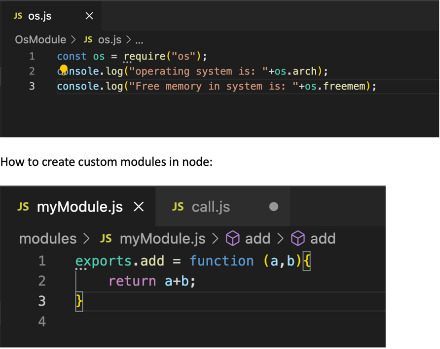

```shell
Calling from another file:

```
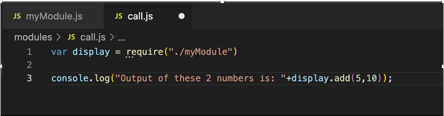

**NPM: node package manager**
```shell
Node provides the inbuilt packages that we can use:
```


```shell
You have 2 options one is providing the house, and another is providing the wood
along with axe, so which one you would prefer. 99% people do prefer inbuilt house,
so node package manager is same as that. It provides you the inbuilt packages
which you can use. 

Configure npm:

1.	Run npm init
2.	Will generate package.json.

Package is like dependency in pom. There is one package called chalk which we
can use for more attractive UI. It provides more colorful content like iterm.

Download it: npm i chalk

Once you downloaded, it will automatically added to your package.json file:

```
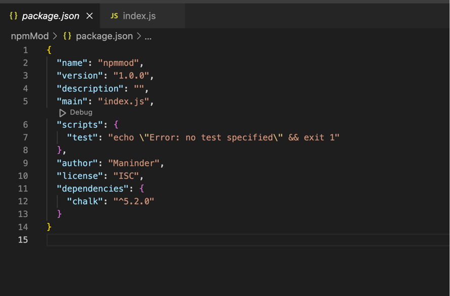

```shell
Somehow require module to import is not working.
So, use import statement to get it. For this, we need to add module in 
package.json file:

```
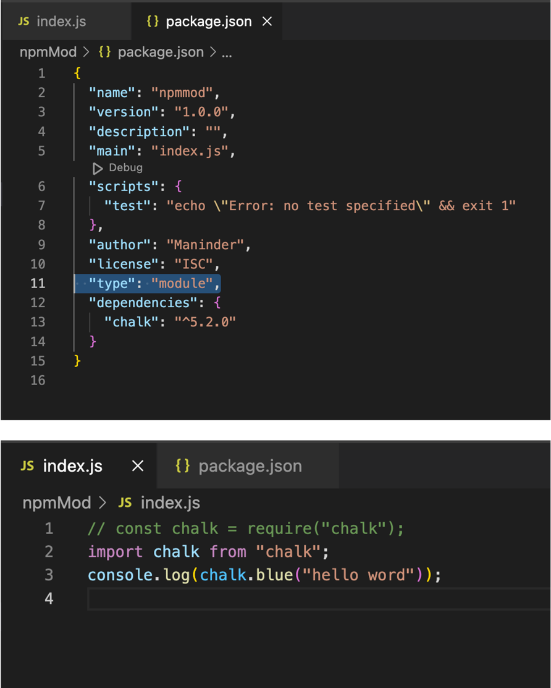

**Nodemon**
```shell
As of now, when we do some changes in our js file then we need to restart the node
like:
Node test.js 

But if I say I do changes and I don’t want to run it again and again so to get
this, we can use “nodemon”:

Just give “nodemon index.js”

```
**HttpServer**
```shell
const http = require("http");
const server = http.createServer((request, response)=>{
    response.end("Hello team: ");

});

server.listen(8000, "localhost", ()=>{
    console.log("Listening to the port 8000")
});

when you hit:
http://localhost:8000/

it will give response:
"hello team"

```
**URL:**

*if you want to add URL of pages like when page URL is this then display this
or when it does not exist then give us error:*
```shell

const http = require("http");
const server = http.createServer((request, response)=>{
    if(request.url == "/"){
        response.end("Hello team: ");
    }
    else if (request.url == "/about"){
        response.end("About page ");

    }else{
        response.writeHead(404, {"content-type": "text/html"});
        response.end("<h1> 404 Error page </h1>");
    }

});

server.listen(8000, "localhost", ()=>{
    console.log("Listening to the port 8000")
});

```
**How to convert JSON to String and String to JSON**
```shell
const bioData = {
    name : "Maninder",
    age : 29,
    country : "Canada"
}

// convert string to json data:
const jsonData = JSON.stringify(bioData);
console.log("The JSON data is: "+jsonData);

// convert json to String data:
const stringData = JSON.parse(jsonData);
console.log("The string data is: "+stringData.name)

```
**How to create Custom API**
```shell
We want to display data when we hit our API.
Suppose, I have list of books so when user hit "/books" endpoints,
it should display the list:

for this we need to save the data that we want to return.
and when we call this endpoints, return this file:

```
**data.json:**
```shell

[
    {
        "id": 40,
        "name": "code cleaner",
        "price": 12.25
    },
    {
        "id": 39,
        "name": "code cleaner",
        "price": 12.25
    },
    {
        "id": 38,
        "name": "book1",
        "price": 12.25
    }
]

```
**index.js:**

```shell
const http = require("http")
const fs = require("fs");
const url = require("url");


http.createServer(function (req,res){
    const data = fs.readFileSync(`${__dirname}/data.json`,"utf-8");
    const objectData = JSON.parse(data);
    if(req.url == "/books"){
        res.writeHead(200, { "content-type": "application/json" });
        res.end(data);
    
    }
}).listen(8000);

```
**Output:**

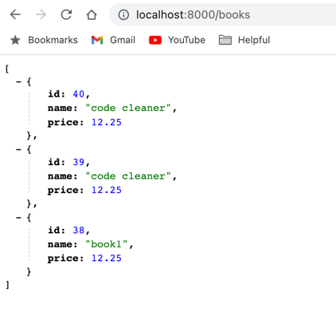

**Events module:**
```shell
1. How to send event in node.
2. For this we need to import events module.
3. The benefit of event module in node is that we can fire multiple events having
same name. Suppose, you want to register a user on FB. Once user register,
you want to send an email too and also show message on UI that message is registerd.
means you are sending 2 events:
1. Register user successfully.
2. Email send.

```
**Code:**
```shell
const EventEmitter = require("events");
const event = new EventEmitter();

event.on("name", ()=>{
    console.log("My name is Maninder");
})

event.on("name", ()=>{
    console.log("Second event");
})

event.emit("name");
```


**You can also pass parameters in emit method.**

```
**Example:**

```shell
const EventEmitter = require("events");
const event = new EventEmitter();

event.on("name", ()=>{
    console.log("My name is Maninder");
})

event.on("name", ()=>{
    console.log("Second event");
})

event.on("name", (sc, msg)=>{
    console.log("Third event");
    console.log(`Status code is: ${sc} and the page is: ${msg} `)
})

event.emit("name",200, "OK");
```


